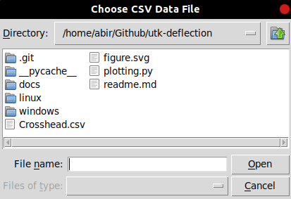
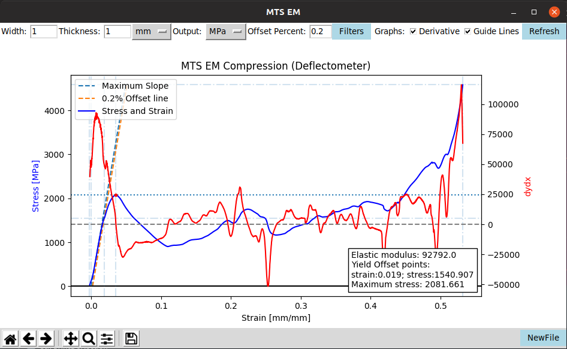
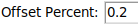
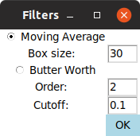
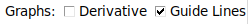
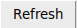

==================
How to use the app
==================

--------
Windows
--------

Running application
*******************

*Double click the file named `plotting.exe` to start application*

*A GUI will open requesting the data csv file*

*Upon selection of the csv file, the data will be processed and plotted*

-----------
User inputs
-----------

*Inputs take effect after user uses Enter key or clicks refresh button*

**At the top:**

*The user is given the option to change material area by providing width and thickness*
*The user is also able to specify the unit for the width and thickness*

*The user is able to select the output type*

*The user is given the option to change percentage of the offset line*

*The user is given the option to change filter used for derivative for smoothing*

*The user is given the option to change what appears on graph [derivative, guidelines]*

*The user is given the option to update the graph with changed inputs*
*This button can be invoked with Enter key-press as-well*

**At the bottom:**

*The user is given the control to interact with the graph*
*The user is given the option to save the graph*

*The user is given the option to open a new csv file*

